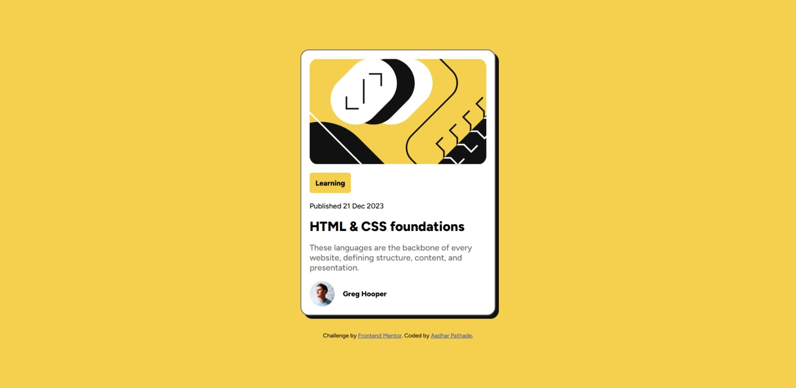

# Frontend Mentor - Blog preview card solution

This is my solution to the [Blog preview card challenge on Frontend Mentor](https://www.frontendmentor.io/challenges/blog-preview-card-ckPaj01IcS). It focuses on responsive layout design, semantic HTML, and good accessibility practices.

## Overview

### The challenge

Users should be able to:

- View the optimal layout for the component depending on their device's screen size
- See hover and focus states for interactive elements

### Screenshot

### Links

- 📂 **Solution Repo**: [GitHub Repository](https://github.com/AadharPathade/Frontent-Mentor-Challenges/tree/main/1.%20Blog%20preview%20card)
- 🌐 **Live Site**: [Live Demo](https://frontent-mentor-challenges.vercel.app/)

## My process

### Built with

- Semantic HTML5 markup
- CSS custom properties (variables)
- Flexbox
- Responsive layout using `max-width` and `width: 100%`
- Relative units (rem, %) instead of fixed pixels

### What I learned

- How to use relative units to build responsive components without media queries
- Effective use of `max-width` and `padding` to maintain consistent spacing
- Applying hover and focus styles for better accessibility
- Structuring semantic HTML components cleanly with utility variables

