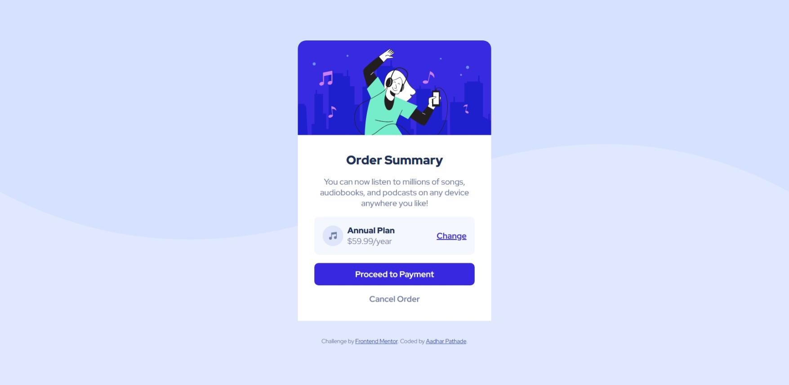

# Frontend Mentor - Order Summary Card Solution

This is my solution to the [Order Summary Card challenge](https://www.frontendmentor.io/challenges/order-summary-component-QlPmajDUj) on Frontend Mentor. It helped me sharpen my HTML and CSS layout skills by building a responsive component from scratch.

## Table of Contents

- [Overview](#overview)
- [Screenshot](#screenshot)
- [Links](#links)
- [Built With](#built-with)
- [What I Learned](#what-i-learned)
  
---

## Overview

### The Challenge

Users should be able to:

- View the component at mobile and desktop screen sizes
- See hover states for interactive elements

### Screenshot

## Links

- [Solution on Frontend Mentor](https://www.frontendmentor.io/solutions/responsive-order-summary-component-using-flexbox-nIdraApstL)
- [Live Site](https://frontent-mentor-challenges-yvfr.vercel.app/)

---

## Built With

- Semantic HTML5
- CSS custom properties
- Flexbox
- Mobile-first workflow
- Responsive design

---

## What I Learned

- How to create card-based layouts using `flexbox`
- How to use background images responsively
- Writing clean, reusable CSS with proper structure
